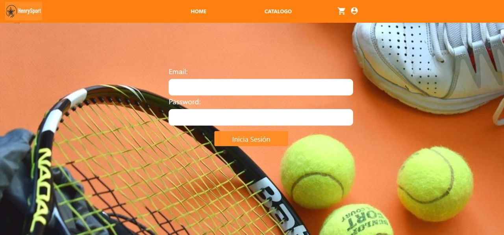
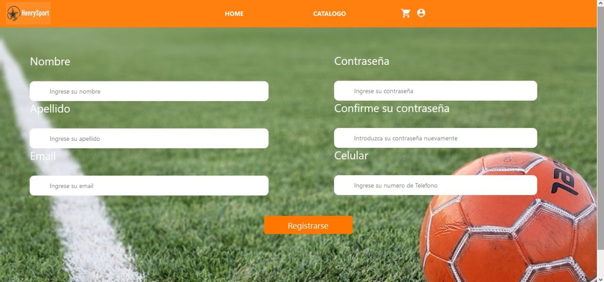
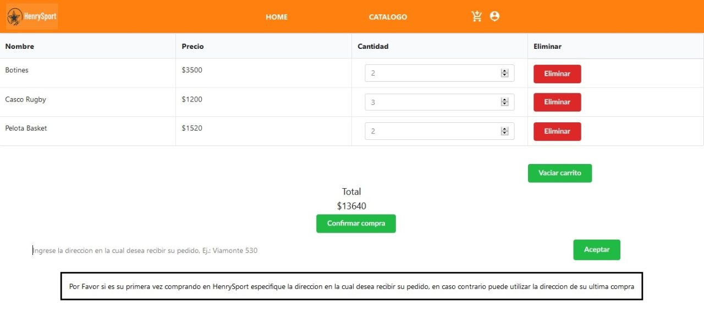

<p align='left'>
    
</p>

# Henry

## HenrySport
Este es un proyecto que creamos a partir de la educación recibida en [Soy Henry](https://www.soyhenry.com/), que consiste en crear una aplicación full-stack React desde cero.

### Nuestras tecnologías

- Back End:
    + Node.js
    + Express
    + Passport
    + Sequelize
    + Nodemailer

- Front End:
    + HTML - CSS - Javascript
    + React
    + React-Bootstrap
    + Redux
    + Firebase

- Database: 
    + PostgreSQL

### COMENZANDO

cuenta con dos carpetas: `api` y `client`. En estas carpetas estará el código del back-end y el front-end respectivamente. (En ambos instaralar NPM INSTALL)

Para cargar en tu base de datos En `api` vas a tener que crear un archivo llamado: `.env` que tenga la siguiente forma:

```
DB_USER=usuariodepostgres
DB_PASSWORD=passwordDePostgres
DB_HOST=localhost
EMAIL= emailtienda 
PASSWORD= passwordemail
```
Utilizando PGAdmin vas a crear tu nueva database "development".
Tenés que reemplazar `usuariodepostgres` y `passwordDePostgres` con tus propias credenciales para conectarte a postgres. Este archivo va ser ignorado por github, ya que contiene información sensible (las credenciales).


### EJECUTAR :
 
 Para ejecutar el proyecto una vez hecho los pasos anteriores vamos a correr NPM START en Api y luego en Client.


#### Requerimientos

La aplicación del e-commerce va a contar con los siguientes requerimientos:

#### Usuarios no Autenticados

Un Visitante anónimo debería poder navegar tu e-commerce, ver y buscar productos.

###### Como un Guest yo quiero...

- PRODUCTOS:
    + ...ver la lista completa de productos (catálogo), para ver todo lo disponible para comprar.
    + ...refinar el listado por categorías, para poder ver los items en los que estoy interesado.
    + ...buscas productos, para poder encontrar rápido los productos que quiero comprar.
    + ...ver los detalles de un producto individual (incluida las fotos, descripciones, reviews, etc...), asi puede determinar si quiero ese producto o no.
    
- CARRITO:
    + ...poder agregar items a mi carrito de compras desde el listado o desde a página de detalles de un producto, para poder comprarlos despues.
    + ...sacar items de mi carrito, en caso que decida no quererlos.
    + ...editar cantidades de los items de mi carrito, en caso que quiera mas o menos cantidad de un item en particular.
    + ...refrescar la página, o irme y volver, y todavía tener mi carrito de compras (sin haberme creado una cuenta). (Podés usar sessionStorage, localStorage, cookies, o JWT).
    + ...poder crearme una cuenta, loguearme y seguir editando ese mismo carrito, asi no pierdo los items seleccionados.
- CHECKOUT:
    + ...poder comprar todos los items de un mi carrito.
    + ...especificar una dirección de envio y un email cuando hago el checkout, asi me envien la compra a lugar que dije.
    + ...recibir un email de confirmación que hice la compra.
    + ...recibir un email de notificación cuando la orden fue despachada.
- GESTION DE CUENTA:
    + ...poder crear una cuenta, asi puede hacer otras cosas como dejar un review.
    + ...poder logearme usando Google o Github, para no tener que acordarme de un password nuevo.

##### Usuarios Autenticados

Los usuarios que hayan creado su cuenta, podrán hacer todo lo que puede hacer un usuario guest y además:

##### Como un Usuario Autenticado yo quiero...

- GESTION DE CUENTA:
    + ...poder desloguearme, asi nadie más pueda usar mi sesión.
    + ...ver el historial de ordenes previas, asi puede reever las ordenes que hice en el pasado.
    + ...ver los detalles de una orden que hice en el pasado, incluyendo:
        * Los items comprados, con sus cantidades.
        * Links a la página del producto comprado.
        * Fecha y hora de la compra.
- REVIEWS:
    + ...poder dejar reviews a los productos, que incluyan texto y un sistema de cinco estrellas.

#### Admin

Los usuarios administradores pueden manejar el sitio, los productos que se listan y los items que están disponibles.

##### Como un administrador yo quiero...

- GESTION DE PRODUCTOS:
    + ...poder crear y editar productos, con nombre, descripción, precio y uno o más fotos, tal que los visitantes puedan ver la última información de lo que se vende.
    + ...poder crear categorías, para que los usuarios puedan filtrar los items.
    + ...poder agregar o sacar categorías de los items (los items deben poder aceptar múltiples categorías).
    + ...gestionar la disponibilidad de un item. (un item que no esta disponible, no deberá estar listado en la página, pero su detalle debe seguir siendo accesible desde el historial de compras o con su URL, pero debe mencionar que el item no está disponible).

- GESTION DE ORDENES:
    + ...poder ver una lista de todas las ordenes, para poder ver y revisar las ordener.
    + ...poder filtrar as ordenes por su estado (creada, procesando, cancelada, completa).
    + ver los detalles de una orden específica, asi puedo revisarla y actualizar su estado.
    + ...poder cambiar el estado de una orden (creada => procesando, procesando => cancelada || completa).

- GESTION DE USUARIOS:
    + ...poder hacer que un usuario se convierta en admin.
    + ...borrar a un usuario, asi no puedan logearse más.
    + ...forzar una password reset para un usuario.


## Capturas del Ecommerce
 - Iniciar sesión: 
 

 - Registrarse:


- Todos los productos:


 - Carrito:


### Nosotros
Somos un grupo de 5 [Soy Henry](https://www.soyhenry.com/) estudiantes. Aquí están sus perfiles: 

## Github
- [Rubén Gustavo Altamiranda](https://github.com/ioogustavo)
- [Agustina Grimaldi](https://github.com/AgusGrimaldi)
- [Cecilia Hansen](https://github.com/cecihansen)
- [Ignacio Videla](https://github.com/ignaciovid)
- [Matias Ruiz](https://github.com/matiasruizmdz)

## Linkedin
- [Rubén Gustavo Altamiranda](https://www.linkedin.com/in/gustavoaltamiranda/)
- [Agustina Grimaldi](https://www.linkedin.com/in/agustina-belen-grimaldi-b214301b3/)
- [Cecilia Hansen](https://www.linkedin.com/in/hansen-cecilia/)
- [Ignacio Videla](https://www.linkedin.com/in/ignacio-videla-7b00711b3/)
- [Matias Ruiz](https://www.linkedin.com/in/matias-ruiz-mdz/)