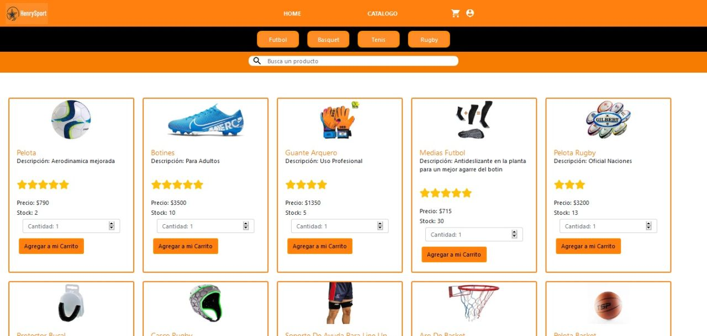

<p align='left'>
    
</p>

# Henry

## HenrySport
Este es un proyecto que creamos a partir de la educación recibida en [Soy Henry](https://www.soyhenry.com/), que consiste en crear una aplicación full-stack React desde cero.

### Nuestras tecnologías

- Back End:
    + Node.js
    + Express
    + Passport
    + Sequelize
    + Nodemailer

- Front End:
    + HTML - CSS - Javascript
    + React
    + React-Bootstrap
    + Redux
    + Firebase

- Database: 
    + PostgreSQL

### COMENZANDO

cuenta con dos carpetas: `api` y `client`. En estas carpetas estará el código del back-end y el front-end respectivamente. (En ambos instaralar NPM INSTALL)

Para cargar en tu base de datos En `api` vas a tener que crear un archivo llamado: `.env` que tenga la siguiente forma:

```
DB_USER=usuariodepostgres
DB_PASSWORD=passwordDePostgres
DB_HOST=localhost
EMAIL= emailtienda 
PASSWORD= passwordemail
```
Utilizando PGAdmin vas a crear tu nueva database "development".
Tenés que reemplazar `usuariodepostgres` y `passwordDePostgres` con tus propias credenciales para conectarte a postgres. Este archivo va ser ignorado por github, ya que contiene información sensible (las credenciales).


### EJECUTAR :
 
 Para ejecutar el proyecto una vez hecho los pasos anteriores vamos a correr NPM START en Api y luego en Client.


## Capturas del Ecommerce
 - Iniciar sesión: 
 

 - Registrarse:


- Todos los productos:


 - Carrito:


### Nosotros
Somos un grupo de 5 [Soy Henry](https://www.soyhenry.com/) estudiantes. Aquí están sus perfiles: 

## Github
- [Rubén Gustavo Altamiranda](https://github.com/ioogustavo)
- [Agustina Grimaldi](https://github.com/AgusGrimaldi)
- [Cecilia Hansen](https://github.com/cecihansen)
- [Ignacio Videla](https://github.com/ignaciovid)
- [Matias Ruiz](https://github.com/matiasruizmdz)

## Linkedin
- [Rubén Gustavo Altamiranda](https://www.linkedin.com/in/gustavoaltamiranda/)
- [Agustina Grimaldi](https://www.linkedin.com/in/agustina-belen-grimaldi-b214301b3/)
- [Cecilia Hansen](https://www.linkedin.com/in/hansen-cecilia/)
- [Ignacio Videla](https://www.linkedin.com/in/ignacio-videla-7b00711b3/)
- [Matias Ruiz](https://www.linkedin.com/in/matias-ruiz-mdz/)
